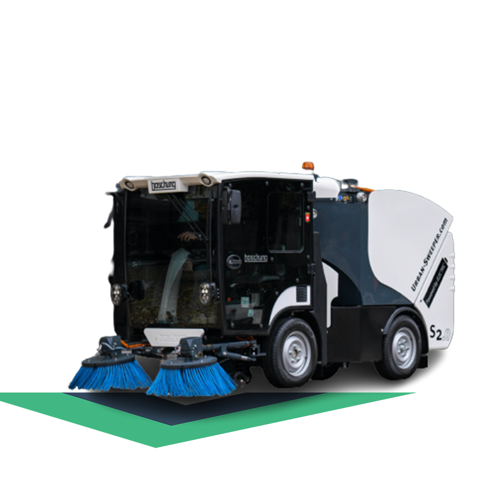

# VueSweeper

A minesweeper clone made in Vue-3, Typescript and Tailwind.

<br />
<br />

# How to use

### Build electron app for win

```bash
$ yarn build:for:electron
$ yarn electron:builder:win
```

### Build electron app for deb

```bash
$ yarn build:for:electron
$ yarn electron:builder:deb
```

### Start electron app in developer mode

```bash
$ yarn electron:dev
```
